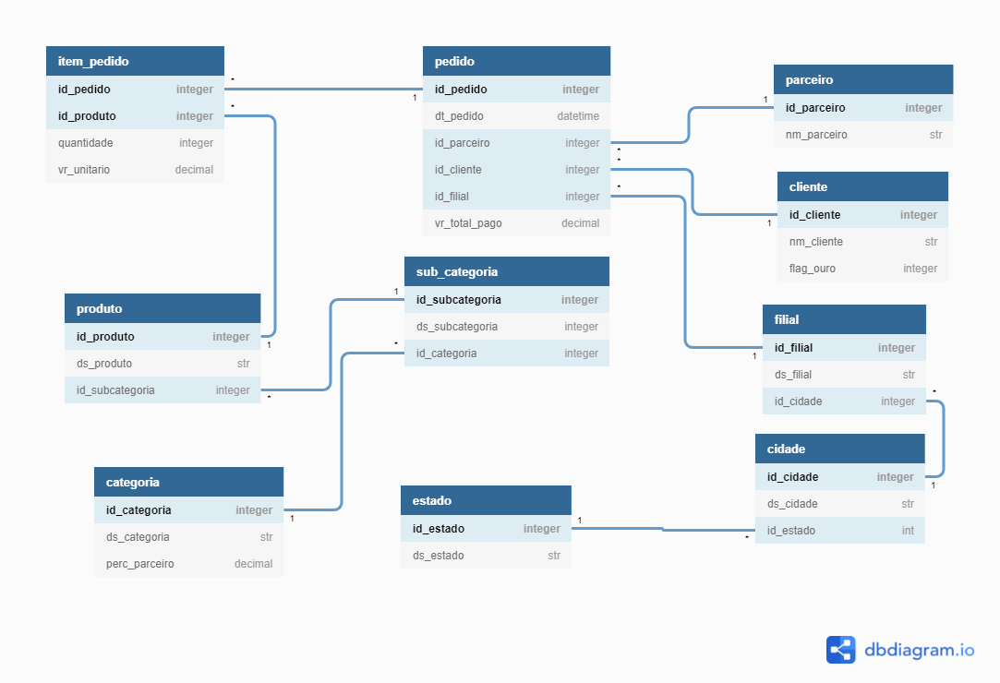

# Desafio Analytics Engineer

## Modelagem Transacional

O modelo transacional apresentado diz respeito a parte de gestão de pedidos de uma plataforma de marketplace. O modelo é apresentado abaixo. Para a solução desse desafio, serão consideradas algumas premissas de funcionamento, essas premissas serão baseadas no ERD apresentado.

### Premissas do Modelo transacional
#### Filial, Cidade e Estado
- Um estado poderá possuir varias cidades, porém uma cidade possuirá apenas um estado
- Uma cidade poderá possuir varias filiais, porém uma filial possuirá apenas uma cidade

#### Item pedido, Produto, Subcategoria, Categoria
- Um produto poderá possuir vários itens pedido, porém um item pedido possuirá apenas um produto
- Uma subcategoria poderá possuir vários produtos, porém um produto possuirá apenas uma subcategoria
- Uma categoria poderá possuir várias subcategorias, porém uma subcategoria possuirá apenas uma categoria

#### Pedido
- Um parceiro poderá possuir vários pedidos, porém um pedido poderá possuir apenas um parceiro
- Um cliente poderá possuir vários pedidos, porém um pedido possuirá apenas um cliente
- Uma filial poderá possuir vários pedidos, porém um pedido possuirá apenas uma filial
- Um pedido possuirá um ou mais item pedido, porém um item pedido possuirá apenas um pedido

#### Premissas de Negócio
- O marketplace poderá ter pedidos para parceiros e para realização própria da Magalu, caso seja realizado pela própria magalu, o id do parceiro deverá ser nulo.
- O pedido diz respeito a ótica do parceiro/magalu, pois na ótica do cliente seria possível fechar um carrinho com pedido com uma combinação de varios parceiros e magalu.
- A loja online da Magazine será
