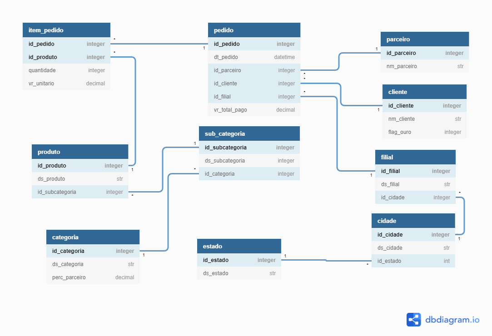
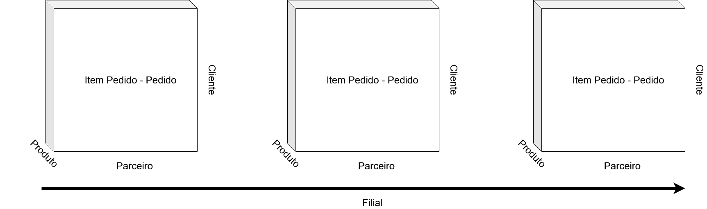
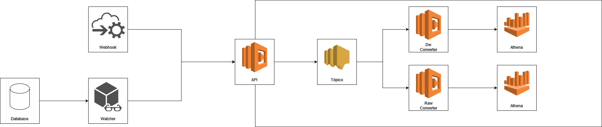
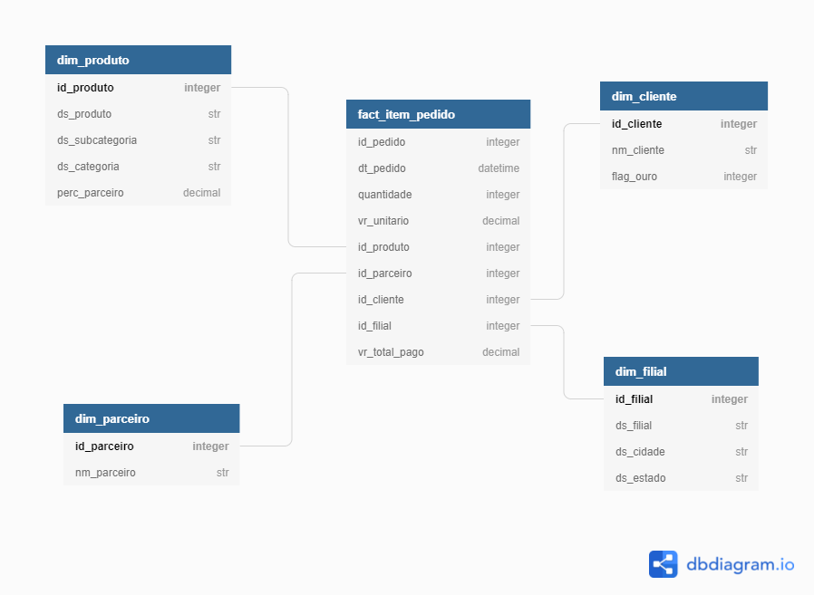

# Desafio Analytics Engineer

## Modelagem Transacional

O modelo transacional apresentado diz respeito a parte de gestão de pedidos de uma plataforma de marketplace. O modelo é apresentado abaixo. Para a solução desse desafio, serão consideradas algumas premissas de funcionamento, essas premissas serão baseadas no ERD apresentado.

### Premissas do Modelo transacional
#### Filial, Cidade e Estado
- Um estado poderá possuir varias cidades, porém uma cidade possuirá apenas um estado
- Uma cidade poderá possuir varias filiais, porém uma filial possuirá apenas uma cidade

#### Item pedido, Produto, Subcategoria, Categoria
- Um produto poderá possuir vários itens pedido, porém um item pedido possuirá apenas um produto
- Uma subcategoria poderá possuir vários produtos, porém um produto possuirá apenas uma subcategoria
- Uma categoria poderá possuir várias subcategorias, porém uma subcategoria possuirá apenas uma categoria

#### Pedido
- Um parceiro poderá possuir vários pedidos, porém um pedido possuirá apenas um parceiro
- Um cliente poderá possuir vários pedidos, porém um pedido possuirá apenas um cliente
- Uma filial poderá possuir vários pedidos, porém um pedido possuirá apenas uma filial
- Um pedido possuirá um ou mais item pedido, porém um item pedido possuirá apenas um pedido

#### Premissas de Negócio
- O marketplace poderá ter pedidos para parceiros e para realização própria da Magalu, caso seja realizado pela própria magalu, o id do parceiro deverá ser nulo.
- O pedido diz respeito a ótica do parceiro/magalu, pois na ótica do cliente seria possível fechar um carrinho com pedido com uma combinação de varios parceiros e magalu.

#### Sugestão de Melhoria na modelagem
- Em um ambiente de mercado, existem diversas disposições de produtos, na forma física, as gôndolas podem possuir a separação por área da casa, por tipo de utilidade e até por motivação de compra. Por exemplo, uma faca de churrasco pode estar na seção de cozinha, na seção de utensílios domésticos e até em uma célula que reune produtos de churrasco. Por isso, deveria ser permitida uma relação M x N de produto com subcategoria.

- Também é possível criar um identificador do pedido para o cliente, pois na visão de negócio do cliente ele faz apenas um pedido, independente de quantos parceiros diferentes venham os produtos que ele solicitou no pedido. Sob a ótica atual, a relação pedido - parceiro aponta a visão do parceiro e não do cliente.

## Fase de Preparação dos Dados
Para execução mais próxima de um banco transacional, os arquivos em csv foram colocados em um arquivo de banco sqlite. O tipo de banco de dados foi selecionado para facilitar o processo de consumo, mas a fase de data prep poderia ser realizada nos mais diversos bancos de dados disponíveis no mercado.

Devido a demanda não especificar o tipo de banco e a forma de disponibilização da informação para o processo de ETL, então será usado queries comuns aos diversos bancos. O processo também tentará se adequar a essa premissa, seja por integração de eventos, seja por integração via lotes de informações extraídas via sql.

O detalhamento desse código está na pasta preparacao_dos_dados, os arquivos foram extraídos na pasta preparacao_dos_dados/raw e lidos e transformados na base de dados sqlite.

## Sugestão de Modelagem dos Dados

Para a modelagem multidimensional, são sugeridas algumas mudanças no modelo transacional. Inicialmente, seriam agregados pedidos e item pedido, aderindo a granularidade de item pedido. Nesse modelo proposto, item pedido e pedido seriam os fatos gerados pelas dimensões. Para as dimensões seriam consideradas 4, Cliente, Produto, Parceiro e Filial. As tabelas relacionadas seriam desnormalizadas como atributos das dimensões. Por exemplo, em filial existem as tabelas cidade e estado que são relacionadas, porém elas podem ser desnormalizadas nas características da filial.

## Extração Para Modelo de Dados
Para o pipeline de fluxo foi pensada uma estrutura intercambiável de integração, tanto por via de watcher no banco de dados como por via de webhook. Como plataforma de cloud foi utilizada a AWS, o fluxo segue pela API de recepção das informações, posteriormente essa informação é inscrita em um tópico com dois subscribers, ambos são funções lambda, e irão inserir as informações no Athena.

O fluxo dos dados pode ser adaptado as demais plataformas de cloud do mercado como Azure e GCP, substituindo para os recursos de cada plataforma. Outra possibilidade nesse processo é utilizar o Terraform como ferramenta de provisionamento de infra através de código.

### Dimensões e Fatos
O diagrama abaixo apresenta o modelo proposto com fatos e dimensões para modelagem multidimensional. Foi feito um ajuste na tabela de subcategoria, pois o ds no ERD original estava como inteiro porém na base de dados ele é representado como String.

- **dim_produto** :
  - Na dimensão de produto foram feitas desnormalizações nas tabelas de categoria e subcategoria.
- **dim_parceiro** :
  - Na dimensão parceiro, a tabela foi mantida da forma original
- **dim_cliente** :
  - Na dimensão cliente a tabela foi mantida da forma original
- **dim_filial** :
  - Na dimensão filial cidade e estado foram desnormalizados para tabela de dimensão filial
- **fact_item_pedido** :
  - O fact item pedido é a agregação da tabela item pedido com a tabela item, na granularidade de item pedido. Dessa forma cada linha representa um item de um pedido, e o vr_total_pago agora representa o produto entre quantidade e vr_unitario. Dessa forma, caso as linhas sejam agregadas é possível fazer a valoração do valor total pago nas diferentes óticas do cubo.

### Queries do Watcher
#### Query do Fact Item Pedido
Na query de fact de item pedido, são agregados os elementos de itens com os de pedido. Nesse caso foi utilizado Inner Join pois alguns itens pedido não possuiam pedidos atrelados, por isso seriam agregados apenas os elementos que possuiam os dois. Outro fator é a variável date_from, que devido a aplicação ser um watcher pode ter sua leitura dos fatos incremental. Esse campo também será o campo versionador na tabela raw e de dw.

~~~ sql
SELECT item_pedido.id_pedido
  , pedido.dt_pedido
  , pedido.id_parceiro
  , pedido.id_cliente
  , pedido.id_filial
  , item_pedido.id_produto
  , item_pedido.quantidade
  , item_pedido.vr_unitario
  , (item_pedido.vr_unitario * item_pedido.quantidade) AS vr_total_pago
FROM item_pedido
INNER JOIN pedido
ON pedido.id_pedido = item_pedido.id_pedido
WHERE pedido.dt_pedido >= '{date_from}'
ORDER BY pedido.dt_pedido ASC
~~~

#### Query Dim Filial
~~~ sql
SELECT filial.id_filial
  , filial.ds_filial
  , cidade.ds_cidade
  , estado.ds_estado
FROM filial
LEFT JOIN cidade
ON cidade.id_cidade = filial.id_cidade
LEFT JOIN estado
ON estado.id_estado = cidade.id_estado
~~~

#### Query Dim Parceiro
~~~ sql
SELECT parceiro.id_parceiro
  , parceiro.nm_parceiro
FROM parceiro
~~~

#### Query Dim Produto
~~~ sql
SELECT produto.id_produto
  , produto.ds_produto
  , subcategoria.ds_subcategoria
  , categoria.ds_categoria
  , categoria.perc_parceiro
FROM produto
LEFT JOIN subcategoria
ON subcategoria.id_subcategoria = produto.id_subcategoria
LEFT JOIN categoria
ON categoria.id_categoria = subcategoria.id_categoria
~~~

#### Query Dim Cliente
~~~ sql
SELECT cliente.id_cliente
  , cliente.nm_cliente
  , cliente.flag_ouro
FROM cliente
~~~

### Modelo Json API
Após as leituras das queries e agregação pelo Watcher para formar uma tabela concatenada, cada linha do lote extraído é formatada para ser enviada como forma de request para a API. Conforme apresentado no modelo anteriormente a API entregará a um tópico as informações integradas. Posteriormente, essas informações serão enviadas as tabelas de raw e de dw. O código para API está escrito em Flask e pode ser encontrado na pasta api.

~~~ json
{
  "id_pedido":"int",
  "dt_pedido":"datetime",
  "quantidade":"int",
  "vr_unitario":"float",
  "vr_total_pago":"float",
  "produto":{
    "id_produto":"int",
    "ds_produto":"str",
    "ds_subcategoria":"str",
    "ds_categoria":"str",
    "perc_parceiro":"float"
  },
  "parceiro":{
    "id_parceiro":"int",
    "nm_parceiro":"str"
  },
  "cliente":{
    "id_cliente":"int",
    "nm_cliente":"str",
    "flag_ouro":"int"
  },
  "filial":{
    "id_filial":"int",
    "ds_filial":"str",
    "ds_cidade":"str",
    "ds_estado":"str"
  }
}
~~~

### Envio para o DW
Ao receber a requisição, a API envia a mensagem para um tópico com dois leitores: pipe_function_dw e pipe_function_raw. Esses Pipelines recebem a informação da mensagem e as envia para o Athena. A função Raw guarda o dado cru oriundo do tópico, enquanto a função Dw guarda o dado trabalhado de mesma origem.

Para armazenamento no Athena, foi utilizado o formato parquet. Com relação a partição, foi usada a data em que o elemento entrou em fila para a tabela de fatos e definidos lotes de 100000 para as dimensões, com base no id. O código desenvolvido para as funções pode ser encontrado na pasta pipe_functions

O deploy das functions foi feito através do zappa, que é uma biblioteca de deploy para lambdas em python. Abaixo segue o modelo de zappa_settings utilizado para esse caso.

~~~ json
{
  "dev": {
      "aws_region": "sa-east-1",
      "project_name": "pipe_function_dw",
      "runtime": "python3.8",
      "s3_bucket": "{{BUCKET}}",
      "role_name":"{{ROLE_NAME}}",
      "role_arn":"{{ARN}}",
      "profile_name":"{{PROFILE_NAME}}",
      "use_apigateway":false,
      "keep_warm":false,
      "lambda_handler": "dw_converter.main",
      "log_level": "INFO",
      "aws_environment_variables": {
      },
      "use_precompiled_packages": false
  }
}
~~~
#### Mock Flow
O código "mock_flow.py" pode ser executado para retirar a necessidade de todo o processo de provisionamento de infra, apenas provisionando o bucket no S3, esse procedimento é mais simples de ser orquestrado mas pode ser utilizado como fluxo inicial de migração para o fluxo. Algumas variáveis de ambiente precisam ser configuradas.

- DATABASE: banco no athena que será armazenado os arquivos
- PATH_S3: path do bucket no s3 que será inserido os arquivos
- QUERY_PATH: Nesse caso, o diretório de execução do mock_flow está externo ao dw, por isso é necessário definir essa variável como "pipe_functions/dw/query"

## Etapa de Cálculo das Comissões

Após todo o processo de extração e de inserção dos dados no Athena, foi criada uma view para detalhar as comissões e bônus por parceiro no mês para isso foi utilizado o código em SQL abaixo:

~~~ SQL
WITH table_pedido_parceiro AS (
  SELECT fact_item_pedido.id_pedido
    , fact_item_pedido.dt_pedido
    , SUBSTR(fact_item_pedido.dt_pedido,1,7) as ano_mes
    , fact_item_pedido.quantidade
    , fact_item_pedido.vr_total_pago
    , dim_parceiro.id_parceiro
    , dim_parceiro.nm_parceiro
    , dim_produto.ds_produto
    , dim_produto.ds_subcategoria
    , dim_produto.ds_categoria
    , dim_produto.perc_parceiro
    , (dim_produto.perc_parceiro*fact_item_pedido.vr_total_pago)/100 AS comissao
  FROM fact_item_pedido
  LEFT JOIN dim_produto
  ON dim_produto.id_produto = fact_item_pedido.id_produto
  LEFT JOIN dim_parceiro
  ON dim_parceiro.id_parceiro = fact_item_pedido.id_parceiro
)

SELECT id_parceiro
    , nm_parceiro
    , ano_mes
    , ROUND(SUM(vr_total_pago),2) AS valor_total_vendido
    , ROUND(SUM(comissao),2) AS valor_total_de_comissao
    , FLOOR(SUM(comissao)/10000)*100 AS bonus
FROM table_pedido_parceiro
GROUP BY id_parceiro, ano_mes, nm_parceiro
~~~

Dessa forma, pode ser executada uma query mensal com o seguinte formato:
~~~ SQL
SELECT nm_parceiro
, valor_total_vendido
, (valor_total_de_comissao - bonus) AS comissao_efetiva
FROM view_parceiros
WHERE ano_mes = '{YYYY-MM}' AND valor_total_de_comissao>100
~~~

Dessa forma, ao selecionar o ano e mês desejado é possível receber as comissões exatas que devem ser cobradas a cada um dos parceiros. O valor total vendido foi colocado ao lado como um parâmetro comparativo. Uma possível sugestão neste caso, é construir queries também para avaliar os parceiros que possuem maiores receitas e menores comissionamentos, e os com maiores receitas com maiores comissionamentos. Isso pode ser importante pois pode ser validado se a fórmula de cálculo das comissões está adequada e também está condizente com a operação dos parceiros.

## Métricas sugeridas
- **Cálculo de gasto médio mensal do cliente ouro e do cliente não ouro**
Avaliar se o cliente ouro engaja o público o suficiente, ou necessita de algumas mudança para se adequar as necessidades do público.
~~~ SQL
WITH table_pedido_cliente AS (
  SELECT fact_item_pedido.id_pedido
    , fact_item_pedido.dt_pedido
    , SUBSTR(fact_item_pedido.dt_pedido,1,7) as ano_mes
    , fact_item_pedido.quantidade
    , fact_item_pedido.vr_total_pago
    , dim_parceiro.id_parceiro
    , dim_parceiro.nm_parceiro
    , dim_produto.ds_produto
    , dim_produto.ds_subcategoria
    , dim_produto.ds_categoria
    , dim_produto.perc_parceiro
    , (dim_produto.perc_parceiro*fact_item_pedido.vr_total_pago)/100 AS comissao
    , dim_cliente.id_cliente
    , dim_cliente.nm_cliente
    , dim_cliente.flag_ouro
  FROM fact_item_pedido
  LEFT JOIN dim_produto
  ON dim_produto.id_produto = fact_item_pedido.id_produto
  LEFT JOIN dim_parceiro
  ON dim_parceiro.id_parceiro = fact_item_pedido.id_parceiro
  LEFT JOIN dim_cliente
  ON dim_cliente.id_cliente = fact_item_pedido.id_cliente
)

SELECT id_cliente
    , nm_cliente
    , ano_mes
    , flag_ouro
    , ROUND(SUM(vr_total_pago),2) AS valor_total_vendido
    , ROUND(SUM(comissao),2) AS valor_total_de_comissao
    , FLOOR(SUM(comissao)/10000)*100 AS bonus
FROM table_pedido_cliente
GROUP BY ano_mes, id_cliente, nm_cliente, flag_ouro
~~~

- **Comparativo entre o ofertado pela Magalu e o ofertado pelo parceiro**
Avaliar a possibilidade de entrar no mercado, a partir da mensuração dos dados de parceiros (preços mais elevados do que os praticados pela magazine).

- **Identificar cidades que necessitam de prospecção de parceiros**
Fazer uma análise comparativa entre os dados públicos brasileiros de consumo e o nível de venda de parceiros em estados. Identificar possíveis gaps (4Ps) de parceiros em regiões específicas, avaliar possibilidade de operação própria e parceira.

- **Clusterização de produtos**
Quais produtos não podem faltar, e devem ser o foco na prospecção de parceiros, pela alta demanda. Quais produtos são toleráveis de não serem vendidos no marketplace.
